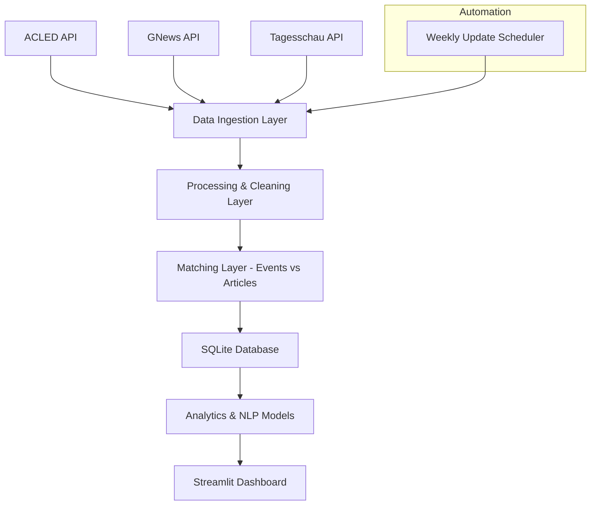

# 🧭 Project Architecture: Conflict-News Dashboard

## Overview

The **Conflict-News Dashboard** is a data-driven system designed to explore how global conflicts and protests are represented in German-language media, contrasting real-world conflict data from ACLED with coverage from sources such as GNews and Tagesschau.  
It automates data collection, processing, matching, analysis, and visualization through a modular, maintainable Python-based architecture.

---

## 🏗️ High-Level Architecture


## 🧭 System Architecture



---

## 🧩 Project Directory Structure

```bash
conflict-news-dashboard/
│
├── app/ # Streamlit frontend
│ ├── dashboard.py
│ ├── components/
│ │ ├── map_view.py
│ │ ├── timeline.py
│ │ ├── sentiment_chart.py
│ └── utils/
│ └── db_connection.py
│
├── data/
│ ├── raw/ # JSON files from APIs
│ ├── processed/ # Cleaned and merged data
│ └── conflict_data.db # SQLite database
│
├── notebook/ # Exploration & prototyping
│ ├── initial_data.ipynb
│ └── Matching_Prototype.ipynb 
│
├── src/
│ ├── init_db.py # load, create and fill initial database
│ ├── fetch_ACLED.py # API ingestion: conflict data
│ ├── fetch_GNEWS.py # API ingestion: media data
│ ├── extract_kewywords.py # Extract keywords from ACLED -> for fetch_GNEWS.API
│ ├── match_events_articles.py # ML/NLP-based matching
│ ├── load_to_db.py # Write data to SQLite
│ └── update_scheduler.py # Weekly automation (cron/bash)
│
├── models/
│ ├── sentiment_model.py
│ ├── topic_model.py
│ └── matching_model.py
│
├── tests/
│ ├── test_api_integrity.py
│ ├── test_db_schema.py
│ └── test_matching.py
│
├── scripts/
│ └── run_pipeline.sh
│
├── config/
│ ├── config.yaml # API keys, DB path, update freq
│ └── logging.conf
│
├── requirements.txt
├── README.md
└── .env # Local credentials (excluded from Git)
```

## 🗄️ Database Structure

**Database:** `conflict_data.db`

### Tables Overview

#### 1. `conflict_events`
| Column | Type | Description |
|---------|------|-------------|
| `event_cntry_id` | INTEGER (PK) | Unique ACLED event ID |
| `event_date` | DATE | Date of event |
| `country` | TEXT | Country where conflict occurred |
| `region` | TEXT | ACLED region |
| `event_type` | TEXT | Protest, battle, etc. |
| `actors` | TEXT | Involved groups or parties |
| `latitude` | REAL | Geo coordinates |
| `longitude` | REAL | Geo coordinates |
| `notes` | TEXT | Event summary |


## Initialize Project

Initialize project:
'''
uv run src/init_db.py
'''
Downloads the latest files for the year specified in the script (2024), creates and loads into the database.

Check for the latest dates in the database
'''
uv run src/util_date.py
'''


