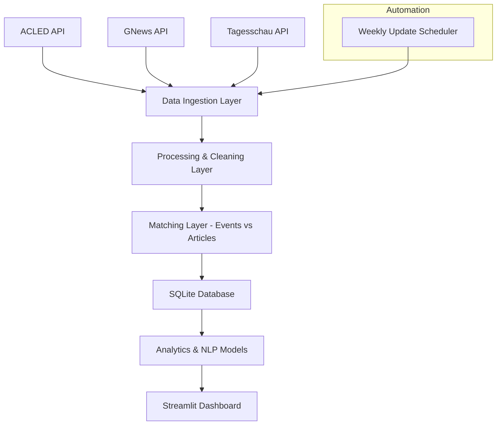

# 🧭 Project Architecture: Conflict-News Dashboard

## Overview

The **Conflict-News Dashboard** is a data-driven system designed to explore how global conflicts and protests are represented in German-language media, contrasting real-world conflict data from ACLED with coverage from sources such as GNews and Tagesschau.  
It automates data collection, processing, matching, analysis, and visualization through a modular, maintainable Python-based architecture.

---

## 🏗️ High-Level Architecture


## 🧭 System Architecture



---

## 🧩 Project Directory Structure

```bash
conflict-news-dashboard/
│
├── app/ # Streamlit frontend
│ ├── dashboard.py
│ ├── components/
│ │ ├── map_view.py
│ │ ├── timeline.py
│ │ ├── sentiment_chart.py
│ └── utils/
│ └── db_connection.py
│
├── data/
│ ├── raw/ # JSON files from APIs
│ ├── processed/ # Cleaned and merged data
│ └── conflict_data.db # SQLite database
│
├── notebook/ # Exploration & prototyping
│ ├── initial_data.ipynb
│ └── Matching_Prototype.ipynb 
│
├── src/
│ ├── init_db.py # load, create and fill initial database
│ ├── fetch_ACLED.py # API ingestion: conflict data
│ ├── fetch_GNEWS.py # API ingestion: media data
│ ├── extract_kewywords.py # Extract keywords from ACLED -> for fetch_GNEWS.API
│ ├── match_events_articles.py # ML/NLP-based matching
│ ├── load_to_db.py # Write data to SQLite
│ └── update_scheduler.py # Weekly automation (cron/bash)
│
├── models/
│ ├── sentiment_model.py
│ ├── topic_model.py
│ └── matching_model.py
│
├── tests/
│ ├── test_api_integrity.py
│ ├── test_db_schema.py
│ └── test_matching.py
│
├── scripts/
│ └── run_pipeline.sh
│
├── config/
│ ├── config.yaml # API keys, DB path, update freq
│ └── logging.conf
│
├── requirements.txt
├── README.md
└── .env # Local credentials (excluded from Git)
```

## 🗄️ Database Structure

**Database:** `conflict_data.db`

### Tables Overview

#### 1. `conflict_events`
| Column | Type | Description |
|---------|------|-------------|
| `event_cntry_id` | INTEGER (PK) | Unique ACLED event ID |
| `event_date` | DATE | Date of event |
| `country` | TEXT | Country where conflict occurred |
| `region` | TEXT | ACLED region |
| `event_type` | TEXT | Protest, battle, etc. |
| `actors` | TEXT | Involved groups or parties |
| `latitude` | REAL | Geo coordinates |
| `longitude` | REAL | Geo coordinates |
| `notes` | TEXT | Event summary |


## Initialize Project

# ACLED Data Pipeline Documentation

This documentation describes the Python scripts and functions used in an automated pipeline for fetching, processing, and analyzing ACLED (Armed Conflict Location & Event Data Project) data.

## Overview

The pipeline consists of seven Python scripts that work together to:
1. Initialize a database with historical ACLED data
2. Fetch new ACLED data periodically
3. Extract keywords and entities from event descriptions
4. Fetch related news articles
5. Monitor database updates

---

## Scripts

### 1. `utils.py`

Utility functions shared across the pipeline.

#### Functions

**`load_config(path="../config/config.yaml")`**
- Loads configuration from a YAML file
- Returns a dictionary with configuration settings (API credentials, database paths, etc.)
- Uses absolute paths relative to the utils.py file location

**`init_logger(name="pipeline")`**
- Initializes a logging system with timestamp and level information
- Returns a logger object for tracking pipeline operations
- Outputs logs to console (StreamHandler)

**`get_db_connection(db_path)`**
- Creates and returns a SQLite database connection
- Takes the database file path as input

**`get_latest_event_date(conn)`**
- Queries the database for the most recent event date
- Returns the latest date or "2000-01-01" if database is empty
- Used to determine what new data needs to be fetched

---

### 2. `init_db.py`

Initializes the database with historical ACLED data for all covered countries.

#### Functions

**`get_access_token(username, password, token_url)`**
- Authenticates with the ACLED API
- Returns an access token for subsequent API requests
- Uses OAuth 2.0 password grant flow

**`fetch_acled_data(country, year, my_token)`**
- Fetches all ACLED events for a specific country and year
- Implements pagination to handle more than 5,000 records
- Saves data to JSON files in the `../raw` folder
- Includes polite delays (0.5-1.5 seconds) between requests

**`create_database(db_path)`**
- Creates the SQLite database with the events table
- Defines schema with 30 fields including:
  - Event identifiers and dates
  - Actor information
  - Location data (country, region, coordinates)
  - Event classification (type, sub-type, disorder type)
  - Source information and notes

**`load_json_to_db(json_path, db_path)`**
- Loads JSON data files into the SQLite database
- Uses `INSERT OR IGNORE` to prevent duplicate entries
- Processes all events from the JSON file

#### Main Execution
- Reads country list from `acled_coverage.json`
- Fetches data for all countries (commented out in current version)
- Loads all JSON files from the raw folder into the database

---

### 3. `fetch_ACLED.py`

Updates the database with the latest ACLED data.

#### Functions

**`get_access_token(username, password, token_url)`**
- Same authentication function as in init_db.py
- Retrieves OAuth access token from ACLED API

**`fetch_acled_data(country, time_period)`**
- Fetches new ACLED data for a specific country and date range
- `time_period` format: "START_DATE|END_DATE"
- Saves results as JSON files with naming convention: `ACLEDouput_{country}_{time_period}.json`
- Returns the output filename
- Handles up to 5,000 entries (prints warning if exceeded)

**`get_newest_date(country, db_path)`**
- Queries the database for the most recent event date for a specific country
- Returns the latest date or "2000-01-01" if no data exists
- Used to determine the starting point for fetching new data

**`load_json_to_db(json_path, db_path)`**
- Loads fetched JSON data into the database
- Same functionality as in init_db.py

---

### 4. `extract_keywords.py`

Extracts keywords and named entities from event notes using NLP.

#### Functions

**`extract_entities(text)`**
- Uses spaCy NLP model to identify named entities
- Extracts entities of types:
  - GPE (Geo-Political Entity)
  - LOC (Location)
  - ORG (Organization)
  - PERSON
  - DATE
  - NORP (Nationalities or religious/political groups)
- Returns a list of tuples: `[(label, text), ...]`

**`extract_keywords(text)`**
- Extracts meaningful keywords from event descriptions
- Identifies:
  - Multi-word noun phrases (e.g., "health workers", "public hospital")
  - Action verbs (e.g., "demonstrated", "marched")
- Filters out stop words
- Returns a list of keywords

**`extract_information(text)`**
- Combines entity and keyword extraction
- Returns a dictionary with both "entities" and "keywords"

**`load_keywords_database(country, db_path)`**
- Processes all events in the database that lack keyword/entity information
- Updates the database with extracted keywords and entities stored as JSON
- Logs progress for each processed event

---

### 5. `fetch_GNEWS.py`

Fetches news articles related to ACLED events (incomplete implementation).

#### Functions

**`get_querywords(country, db_path)`**
- Retrieves events from the database with their keywords and entities
- Returns a pandas DataFrame with:
  - Event metadata (ID, date, country, location, actor)
  - Parsed keywords and entities (from JSON format)
- Intended to generate search queries for news APIs

#### Main Code (Example)
- Demonstrates GNews API usage with German language parameters
- Searches for protest-related articles in a specific date range
- Prints article titles, descriptions, sources, and URLs
- **Note:** API key placeholder needs to be replaced

---

### 6. `pipeline.py`

Main automation script for updating the ACLED database.

#### Main Function

**`main()`**
- Loads configuration
- Specifies target country (currently "Germany")
- Gets the latest date in the database
- Calculates time period: from latest date to one year ago
- Fetches new ACLED data
- Updates the database
- **Note:** Keyword extraction is commented out

#### Workflow
1. Determine what data is missing (date range)
2. Fetch new data from ACLED API
3. Load new data into database
4. (Optional) Extract keywords from new events

---

### 7. `util_date.py`

Utility script to check the latest dates across all countries in the database.

#### Main Function

**`main()`**
- Loads country list from configuration
- Iterates through all countries
- Retrieves the latest event date for each country
- Prints individual country dates
- Calculates and displays the overall latest date across all countries

#### Purpose
- Monitor data freshness across different countries
- Identify which countries need updates
- Verify database population status

---

## Database Schema

### Events Table

The main table contains 30 columns storing comprehensive event information:

**Identifiers & Temporal**
- `event_id_cnty` (PRIMARY KEY): Unique event identifier
- `event_date`: Date of the event
- `year`: Year of the event
- `time_precision`: Precision of the date
- `timestamp`: Unix timestamp

**Event Classification**
- `disorder_type`: Type of disorder
- `event_type`: Main event category
- `sub_event_type`: Detailed event classification

**Actors**
- `actor1`, `actor2`: Primary actors involved
- `assoc_actor_1`, `assoc_actor_2`: Associated actors
- `inter1`, `inter2`: Actor interaction codes
- `interaction`: Overall interaction type
- `civilian_targeting`: Whether civilians were targeted

**Location**
- `iso`: ISO country code
- `region`: Geographic region
- `country`: Country name
- `admin1`, `admin2`, `admin3`: Administrative divisions
- `location`: Specific location name
- `latitude`, `longitude`: Coordinates
- `geo_precision`: Location precision level

**Additional Information**
- `source`: Data source
- `source_scale`: Scale of the source
- `notes`: Detailed event description
- `fatalities`: Number of deaths
- `tags`: Additional tags
- `keywords`: Extracted keywords (JSON)
- `entities`: Extracted entities (JSON)

---

## Workflow Summary

1. **Initialization** (`init_db.py`): Fetch historical data and create database
2. **Regular Updates** (`pipeline.py`): Fetch new events periodically
3. **NLP Processing** (`extract_keywords.py`): Extract keywords and entities
4. **News Matching** (`fetch_GNEWS.py`): Find related news articles
5. **Monitoring** (`util_date.py`): Check data freshness

---

## Dependencies

- `requests`: HTTP requests to ACLED API
- `spacy`: Natural language processing
- `sqlite3`: Database operations
- `pandas`: Data manipulation
- `yaml`: Configuration parsing
- `dateutil`: Date calculations
- `urllib`: URL encoding (for GNews API)

---

## Examples:

Example: Query Database for Analysis

```python
import sqlite3
import pandas as pd
from utils import load_config

# Connect to database
config = load_config()
conn = sqlite3.connect(config["database"]["path"])

# Example: Get all protests in Germany in 2024
query = """
    SELECT event_date, location, actor1, sub_event_type, notes, fatalities
    FROM events
    WHERE country = 'Germany'
    AND year = 2024
    AND event_type = 'Protests'
    ORDER BY event_date DESC
"""

df = pd.read_sql_query(query, conn)
print(f"Found {len(df)} protest events in Germany (2024)")
print(df.head())

conn.close()
````

