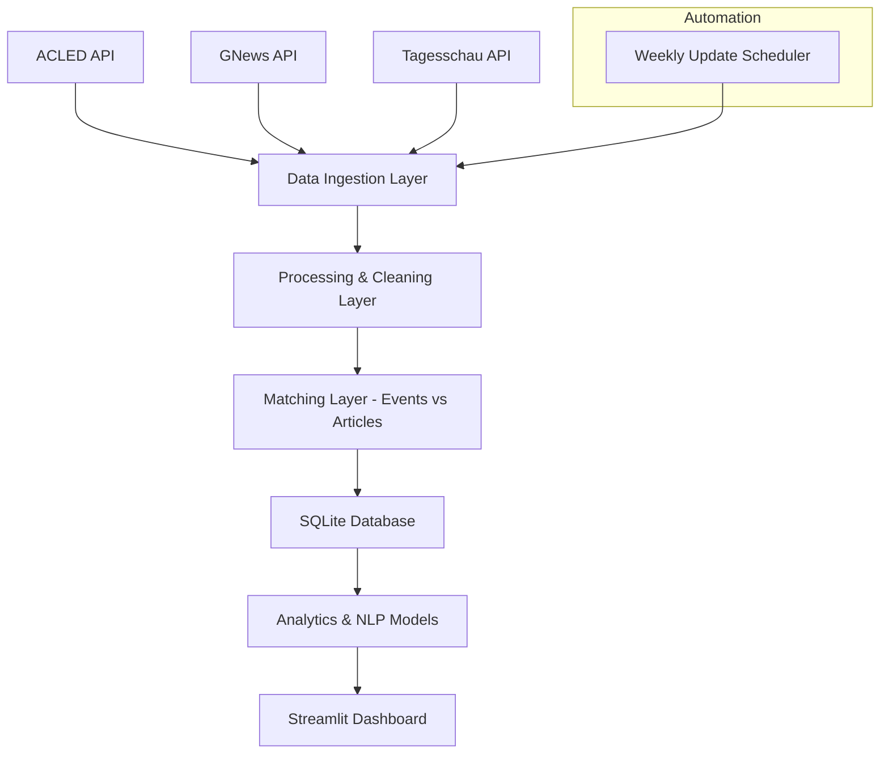

# 🧭 Project Architecture: Conflict-News Dashboard

## Overview

The **Conflict-News Dashboard** is a data-driven system designed to explore how global conflicts and protests are represented in German-language media, contrasting real-world conflict data from ACLED with coverage from sources such as GNews and Tagesschau.  
It automates data collection, processing, matching, analysis, and visualization through a modular, maintainable Python-based architecture.

---

## 🏗️ High-Level Architecture

## 🧭 System Architecture

---

## 🧩 Project Directory Structure

conflict-news-dashboard/
│
├── app/ # Streamlit frontend
│ ├── dashboard.py
│ ├── components/
│ │ ├── map_view.py
│ │ ├── timeline.py
│ │ ├── sentiment_chart.py
│ └── utils/
│ └── db_connection.py
│
├── data/
│ ├── raw/ # JSON files from APIs
│ ├── processed/ # Cleaned and merged data
│ └── conflict_news.db # SQLite database
│
├── notebooks/ # Exploration & prototyping
│ ├── EDA_conflicts.ipynb
│ ├── EDA_media.ipynb
│ └── Matching_Prototype.ipynb
│
├── pipeline/
│ ├── init.py
│ ├── fetch_acled.py # API ingestion: conflict data
│ ├── fetch_news.py # API ingestion: media data
│ ├── transform_clean.py # Cleaning, normalization
│ ├── match_events_articles.py # ML/NLP-based matching
│ ├── load_to_db.py # Write data to SQLite
│ └── update_scheduler.py # Weekly automation (cron/bash)
│
├── models/
│ ├── sentiment_model.py
│ ├── topic_model.py
│ └── matching_model.py
│
├── tests/
│ ├── test_api_integrity.py
│ ├── test_db_schema.py
│ └── test_matching.py
│
├── scripts/
│ ├── init_db.py
│ └── run_pipeline.sh
│
├── config/
│ ├── settings.yaml # API keys, DB path, update freq
│ └── logging.conf
│
├── requirements.txt
├── README.md
└── .env # Local credentials (excluded from Git)

## 🗄️ Database Structure

**Database:** `conflict_news.db`

### Tables Overview

#### 1. `conflict_events`
| Column | Type | Description |
|---------|------|-------------|
| `event_id` | INTEGER (PK) | Unique ACLED event ID |
| `date` | DATE | Date of event |
| `country` | TEXT | Country where conflict occurred |
| `region` | TEXT | ACLED region |
| `event_type` | TEXT | Protest, battle, etc. |
| `actors` | TEXT | Involved groups or parties |
| `latitude` | REAL | Geo coordinates |
| `longitude` | REAL | Geo coordinates |
| `notes` | TEXT | Event summary |

#### 2. `media_articles`
| Column | Type | Description |
|---------|------|-------------|
| `article_id` | INTEGER (PK) | Unique ID for article |
| `source` | TEXT | GNews, Tagesschau, etc. |
| `title` | TEXT | Headline text |
| `content` | TEXT | Article body |
| `url` | TEXT | Source URL |
| `country` | TEXT | Extracted/mentioned country |
| `published_at` | DATE | Publication date |
| `sentiment` | REAL | Polarity score |
| `emotion` | TEXT | Dominant emotion label |
| `keywords` | TEXT | Extracted keywords |

#### 3. `event_article_matches`
| Column | Type | Description |
|---------|------|-------------|
| `match_id` | INTEGER (PK) | Unique match identifier |
| `event_id` | INTEGER (FK) | Linked conflict event |
| `article_id` | INTEGER (FK) | Linked media article |
| `similarity_score` | REAL | Cosine similarity or ML score |
| `temporal_distance` | INTEGER | Days between event & article |
| `geographic_distance` | REAL | Distance in km |
| `match_confidence` | REAL | Combined confidence metric |

---

